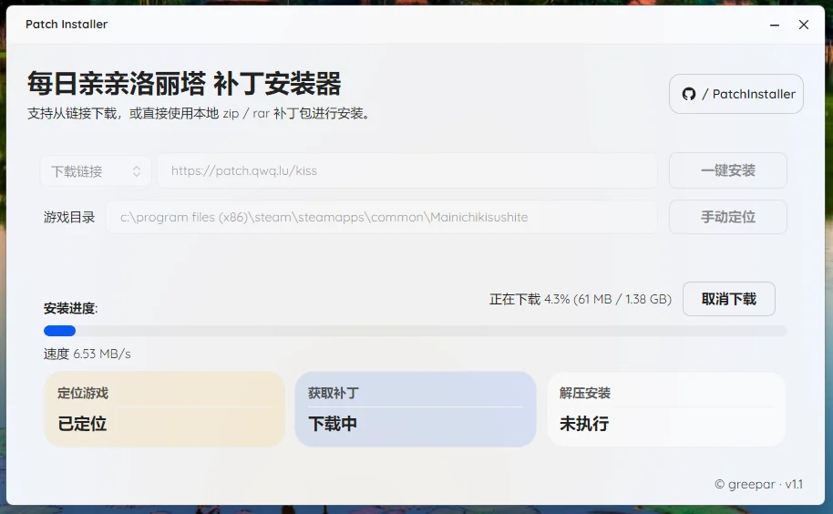

# PatchInstaller

通用补丁安装器模板，基于 Avalonia + NativeAOT。



支持两种配置方式：
- 编译期配置：修改 [InstallerConfig.props](/C:/Users/greep/Downloads/1/PatchInstaller/PatchInstaller/Build/InstallerConfig.props)
- 运行时配置：在程序同目录放一个 `PatchInstaller.json`，无需重新编译

## 编译期配置

主配置文件：
[InstallerConfig.props](/C:/Users/greep/Downloads/1/PatchInstaller/PatchInstaller/Build/InstallerConfig.props)

模板如下：

```xml
<Project>
  <PropertyGroup>
    <InstallerName>PatchInstaller</InstallerName>
    <DefaultPatchUrl>https://patch.qwq.lu/kiss</DefaultPatchUrl>
    <PatchFilePrefix>KissMeEveryday</PatchFilePrefix>
    <SteamGameFolderName>Mainichikisushite</SteamGameFolderName>
  </PropertyGroup>
</Project>
```

字段说明：
- `InstallerName`：界面主标题
- `DefaultPatchUrl`：默认补丁下载链接，可留空
- `PatchFilePrefix`：自动识别本地补丁时的文件名前缀(适合自带补丁压缩包)
- `SteamGameFolderName`：Steam 游戏目录名，用于自动定位

## 运行时 JSON 配置

如果你不想重新编译，可以在程序同目录放一个：

```text
PatchInstaller.json
```

程序启动时会优先读取它。只要这个文件存在，就会覆盖编译期默认值。

示例文件：
[PatchInstaller.json.example](/C:/Users/greep/Downloads/1/PatchInstaller/PatchInstaller/PatchInstaller.json.example)

示例内容：

```json
{
  "productName": "PatchInstaller",
  "defaultPatchUrl": "https://example.com/patch/latest.zip",
  "patchFilePrefix": "Patch",
  "steamGameFolderName": "YourSteamGameFolder"
}
```

支持字段：
- `productName`：标题与产品名
- `defaultPatchUrl`：默认下载链接或直链
- `patchFilePrefix`：自动识别本地补丁时的前缀
- `steamGameFolderName`：Steam 游戏目录名

读取优先级：
1. `PatchInstaller.json`
2. `installer.json`
3. `InstallerConfig.props`

## 可选：修改图标

默认图标文件：
[avalonia-logo.ico](/C:/Users/greep/Downloads/1/PatchInstaller/PatchInstaller/Assets/avalonia-logo.ico)

修改方式：
1. 准备一个 `.ico` 文件
2. 直接替换默认图标文件
3. 或修改 [PatchInstaller.csproj](/C:/Users/greep/Downloads/1/PatchInstaller/PatchInstaller/PatchInstaller.csproj) 里的：

```xml
<ApplicationIcon>Assets\avalonia-logo.ico</ApplicationIcon>
```

例如改成：

```xml
<ApplicationIcon>Assets\my-icon.ico</ApplicationIcon>
```

## 构建方法

### 方法一：Fork 后修改配置，用 GitHub Actions 构建

适合不想在本地装完整环境。

步骤：
1. Fork 这个仓库
2. 修改 [InstallerConfig.props](/C:/Users/greep/Downloads/1/PatchInstaller/PatchInstaller/Build/InstallerConfig.props)，或者准备运行时 `PatchInstaller.json`
3. 如有需要，替换图标
4. Push 到你自己的仓库
5. GitHub Actions 会执行 [.github/workflows/build.yml](/C:/Users/greep/Downloads/1/PatchInstaller/.github/workflows/build.yml)
6. 在 Actions 产物里下载构建结果

### 方法二：下载到电脑上，用 `dotnet publish` 本地构建

要求：
- Windows
- .NET 10 SDK
- Visual Studio C++ 工具链 / Build Tools

命令：

```powershell
dotnet publish .\PatchInstaller\PatchInstaller.csproj -c Release -r win-x64
```

发布目录：

```powershell
.\PatchInstaller\bin\Release\net10.0\win-x64\publish
```

主程序通常是：

```powershell
.\PatchInstaller\bin\Release\net10.0\win-x64\publish\PatchInstaller.exe
```

## 使用说明

### 本地补丁自动识别

程序启动时会自动扫描程序同目录下：
- `patchFilePrefix*.zip`
- `patchFilePrefix*.rar`
- `patchFilePrefix*.7z`

找到后会自动填入本地补丁。

### 默认链接下载

如果配置了默认链接，程序可以直接从默认地址下载并安装。

### 临时文件

- 下载和解压工作目录：`%TEMP%\PatchInstaller`
- 安装成功、失败、取消后，都会自动清理临时目录

License: [MIT](/C:/Users/greep/Downloads/1/PatchInstaller/LICENSE)
